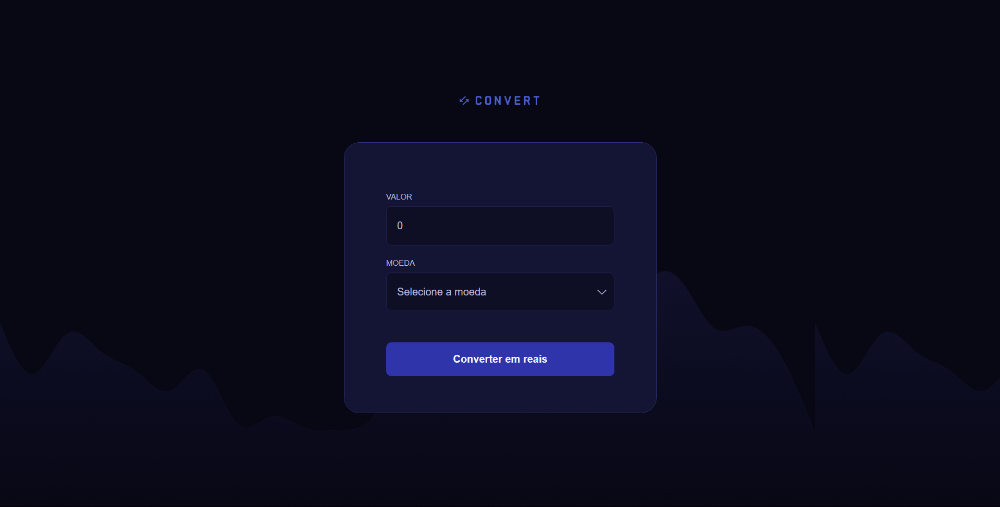

<h1 align="center">💱 Convert</h1>

  <a href="#-o-projeto">O Projeto</a>&nbsp;&nbsp;&nbsp;|&nbsp;&nbsp;&nbsp;
  <a href="#-tecnologias">Tecnologias</a>&nbsp;&nbsp;&nbsp;|&nbsp;&nbsp;&nbsp;
  <a href="#-layout">Layout</a>

  

## 💻 O Projeto

O **Convert** é uma aplicação web de conversão de moedas estrangeiras para Real Brasileiro. O usuário informa um valor e seleciona a moeda (Dólar, Euro ou Libra), e o app calcula o equivalente em reais exibindo a cotação utilizada e o total formatado.

O foco do desenvolvimento estava na lógica em JavaScript, e os principais destaques incluem:

1. **Manipulação do DOM:** captura de elementos, escuta de eventos (`addEventListener`, `onsubmit`) e atualização dinâmica de conteúdo via `textContent` e `classList`.
2. **Validação de input com regex:** uso de `/[^\d,]/g` para restringir o campo a apenas dígitos e vírgula, prevenindo entradas inválidas em tempo real.
3. **Formatação monetária nativa:** uso da API `Intl` via `toLocaleString("pt-br", { style: "currency", currency: "BRL" })` para exibir valores no padrão brasileiro sem bibliotecas externas.

## 🚀 Tecnologias

* **JavaScript:** toda a lógica da aplicação — captura de eventos, validação de input com regex, cálculo de conversão, tratamento de erros e renderização do resultado no DOM.
* **HTML5 & CSS3:** estrutura e estilização fornecidas pelo instrutor; contribuição própria limitada à adição do favicon.
* **Google Fonts:** tipografias **Roboto** e **IBM Plex Mono** para identidade visual do projeto.
* **Git & GitHub:** versionamento e deploy da aplicação.
* **Figma**

## 🔖 Layout

Você pode visualizar e interagir com o projeto através dos links abaixo:

* 📲 **[Acesse o layout original do projeto aqui](https://www.figma.com/community/file/1360315742205904074)**
* 👉 **[Acesse o site funcionando aqui](https://alissonfa.github.io/convert)**

**Para rodar no seu computador (Local):**
1. Faça o download ou clone o repositório.
2. Certifique-se de que a estrutura de pastas está correta.
3. Dê um duplo clique no arquivo `index.html` ou abra através da extensão *Live Server* no seu editor de código.

---

Feito com 💜 por **[AlissonFA](https://www.linkedin.com/in/alissonfa/)**